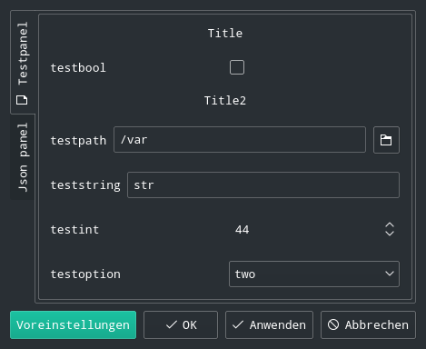

SettingsWidget-qt5
=================

Simple Qt5 Widget that can be used to display and edit Settings. Settings can be defined in code or with
JSON files.

Demonstration
-------------

A simple demo of the widget is provided in ./settingswidget_demo

License
-------

LGPLv3+, See LICENSE 
Copyright (C) 2016 Sebastian Schmidt <schro.sb@gmail.com>
